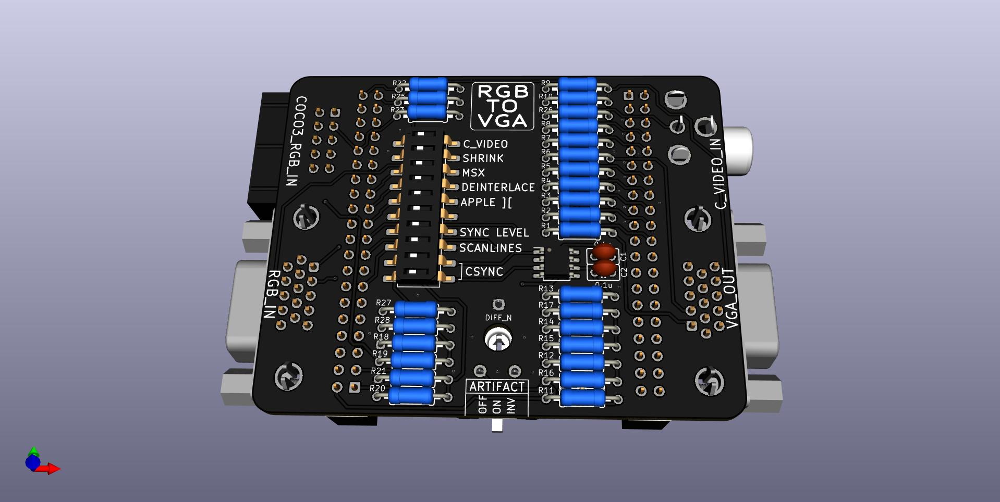
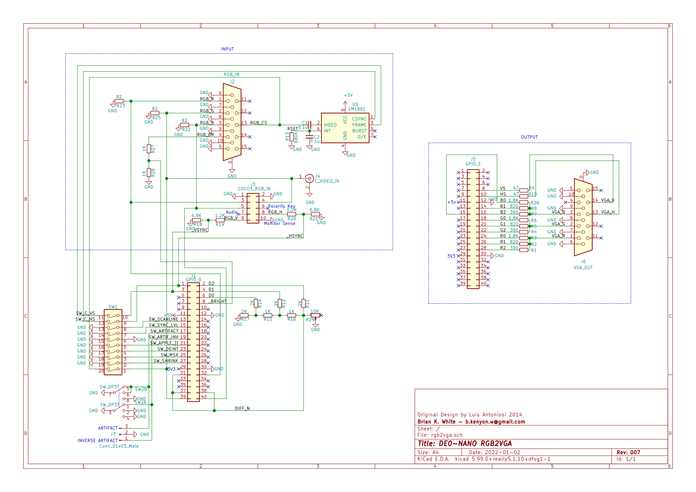

# rgb2vga
Convert 15khz RGB to 31khz VGA

Uses Altera DE0-Nano FPGA development board to convert analog 15Khz RGB signal to VGA 31Khz 256 color.

This is a clone of the original design by Luis Felipe da Costa Antoniosi, to provide the schematic, pcb, vhdl, and docs all together in one place, and to provide editable work files.

For more information and directions see the [original documentation](https://sites.google.com/site/tandycocoloco/rgb2vga)

Don't rush out to buy the parts yet. As of v003 this is tested, the PCB and BOM links are good and it works. That's what's in the video. But there are already some updates on the way, so I suggest wait for v004. The "lowprofile" branch is v004, but isn't done yet.

[PCB from OSHPark](https://oshpark.com/shared_projects/a1T9J3OD)  
[PCB from PCBWAY](https://www.pcbway.com/project/shareproject/de0_nano_fpga_rgb2vga.html)  

[BOM from DigiKey](https://www.digikey.com/short/7fwcd5wr)

[DE0-Nano](http://www.terasic.com.tw/cgi-bin/page/archive.pl?Language=English&No=593)  
 (or [search ebay](https://www.ebay.com/sch/i.html?_nkw=de0-nano&_sacat=0&LH_TitleDesc=0&_odkw=de0+nano&_osacat=0&_sop=15))  

[Gerbers, Firmware](../../releases/latest)

# Directions  
## Building the PCB  
- Polarity keys for the coco3 rgb cable and connector  
  - Extract pin 6 from the 2x5 pin coco3 rgb connector before soldering. This is the center pin on the bottom row, opposite/away from the polarity notch. Pin 5 is in the way, just cut pin 6 on the back side and pull out from the front side.  
  - Insert a plug into pin 6 on each end of the ribbon cable.  This is the center pin on the opposite row away from the the polarity bump.  
- Solder the surface mount LM1881 first.  
- Solder all other parts, any order.  
- Turn the trim pot to 50%.  

## Programming the DE0-Nano  
### Install Quartus  
https://fpgasoftware.intel.com/  
- Select edition: Lite  
- Individual Files

Download just these two parts:  
- Quartus Prime  
- Cyclone IV device support  

### Compile the VHDL  
Start Quartus and connect the usb cable  
Open Project -> vhdl/rgb2vga.qpf  
Processing -> Start Compilation  

This produces the file: output_files/rgb2vga.sof

File -> Convert Programming Files...  
Open Conversion Setup Data... -> DE0-Nano.cof  
Generate  
Close  

This produces the file: output_files/rgb2vga.jic

### Program the DE0-Nano  
Tools -> Programmer  
Hardware Setup... -> USB-Blaster  (should be already autodetected)
Delete any entries pre-loaded in the middle section (probably has output_files/rgb2vga.sof)  
Add File... -> output_files/rgb2vga.jic  
Tick "Program/Configure"  
Start  

## Assemble
- Put the RGB2VGA and DE0-Nano together with the trim pot on the same side as the USB connector.  
- For use with a TANDY Color Computer 3, leave all jumpers open and all dip switches off, except turn the Artifact switch on. For some games, turn Artifact off as desired.

# TODO  
* Better directions  
* Enclosure  
* Lowprofile / v004  
* Bigger switch or button for Artifact

# Changelog
* 20201104 [v003](../../tree/v003)  
 Re-draw the schematic in KiCad from the original png image. Same circuit, different layout.  
 Ed Snider / Roger Taylor resistor values.  
 Add the RGBI bright channel resistors  
 Full BOM from DigiKey, except for the DE0-Nano.  

* 20211101 [v002](../../tree/v002)  
 Incorporate the additional blue channel bodge resistor (now R26)  
 Routing cleanups for clearances and zone fills  

* 20211101 [v001](../../tree/v001) - Initial commit.  
 Import \*.brd file from https://oshpark.com/shared_projects/QwG4zF3f to make KiCad pcb file.  
 Copy vhdl from https://github.com/lfantoniosi/rgb2vga (forked that repo to start this one).  
 This initial commit preserves the original pcb design for reference.  
