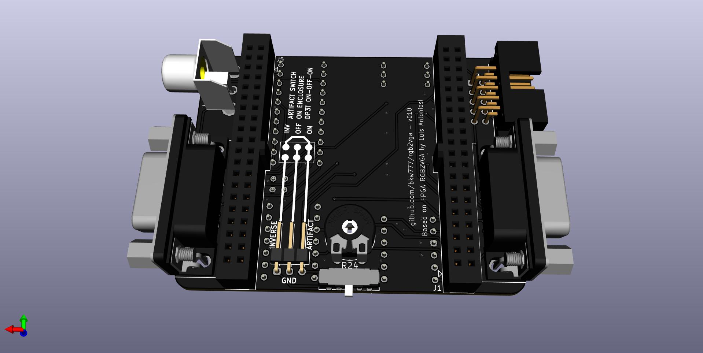

# rgb2vga
Convert 15khz RGB to 31khz VGA

Uses Altera DE0-Nano FPGA development board to convert analog 15Khz RGB signal to VGA 31Khz 256 color.

This is a slightly modified version of the original design by Luis Felipe da Costa Antoniosi.

For more information and directions see the [original documentation](https://sites.google.com/site/tandycocoloco/rgb2vga)

Video showing v003 in action  
[](https://youtu.be/MPYQRHWyUGA)





<!-- [PCB from OSHPark]()  -->
[PCB from PCBWAY](https://www.pcbway.com/project/shareproject/de0_nano_fpga_rgb2vga.html)  

[BOM from DigiKey](https://www.digikey.com/short/47fbdpb0)

[DE0-Nano](http://www.terasic.com.tw/cgi-bin/page/archive.pl?Language=English&No=593) (or [search ebay](https://www.ebay.com/sch/i.html?_nkw=de0-nano&_sacat=0&LH_TitleDesc=0&_odkw=de0+nano&_osacat=0&_sop=15))  
When searching, don't accidentally get **DE0-Nano-SoC**, that's something else.

[3d-printed enclosure - 009.3](https://craftcloud3d.com/offer/d6a42c57-db52-448a-ad5a-508a885461aa?utm_campaign=shareable_cart) - pending testing - 1.5mm thin walls, 100% infill, 0.2mm fitment clearance  

[PCB Gerbers, FPGA Firmware, Enclosure STLs](../../releases/)

# Directions  
## Building the PCB  
- Polarity keys for the coco3 rgb cable and connector  
  - Extract pin 6 from the 2x5 pin coco3 rgb connector before soldering. This is the center pin on the bottom row, opposite/away from the polarity notch. Pin 5 is in the way, just cut pin 6 on the back side and pull out from the front side.  
  - Insert a plug into pin 6 on each end of the ribbon cable.  This is the center pin on the opposite row away from the the polarity bump.  
- Solder the surface mount LM1881 first.  
- Solder SW2 on the bottom before soldering R24.  
- Solder remaining parts in any order.  
- Turn the trim pot to 50%.  

## Programming the DE0-Nano  
Below is the minimum directions and minimum download possible, using the stand-alone Quartus programmer app and the pre-compiled firmware.  
Alternatively, [compile the firmware from the vhdl source](compile_vhdl.md).

### Install the Quartus Standalone Programmer  
https://fpgasoftware.intel.com/  
Select edition: Lite -> Additional Software -> Quartus Prime Programmer and Tools  
(For Linux, install: Individual Files -> Quartus Prime, not the stand-alone programmer package. The stand-alone Quartus programmer package for Linux is broken, missing ```libprotobuf.so.14.0.0```)

### Download the firmware
Download ```rgb2vga.jic``` from [releases](../../releases/)  

### Program the DE0-Nano  
Connect the usb cable  
Launch the Quartus Programmer app  
Hardware Setup... -> USB-Blaster  
Add File... -> ```rgb2vga.jic```  
Tick "Program/Configure"  
Start  

## Assemble
- Remove the acrylic cover from the DE0-Nano, keep the standoffs.  
 Optionally replace the short standoffs on top with the screws from the acrylic cover.  
 If using the 3d-printable enclosure, remove the standoffs too.  
- Put the RGB2VGA and DE0-Nano together with the trim pot on the same side as the USB connector.  
- For TANDY Color Computer 3, leave all dip switches off, except turn the Artifact switch on. For some games, turn Artifact off as desired.

# Changelog
* 20211211 v009  
 Add 3d-printable enclosure  
 Add optional remote artifact switch  
 Clean out non-source files from vhdl  
 Add directions how to compile and flash the firmware  

* 20211126 v004  
 Low profile pcb - flip the tall components to the bottom side  
 Move plugs to use only 2 sides instead of all 4  
 Ground the monitor sense pin on the coco3 rgb input.

* 20211104 [v003](../../tree/v003)  
 Re-draw the schematic in KiCad from the original png image. Same circuit, different layout.  
 Ed Snider / Roger Taylor resistor values.  
 Add the RGBI bright channel resistors  
 Full BOM from DigiKey, except for the DE0-Nano.  

* 20211101 [v002](../../tree/v002)  
 Incorporate the additional blue channel bodge resistor (now R26)  
 Routing cleanups for clearances and zone fills  

* 20211101 [v001](../../tree/v001) - Initial commit.  
 Import \*.brd file from https://oshpark.com/shared_projects/QwG4zF3f to make KiCad pcb file.  
 Copy vhdl from https://github.com/lfantoniosi/rgb2vga (forked that repo to start this one).  
 This initial commit preserves the original pcb design for reference.  
