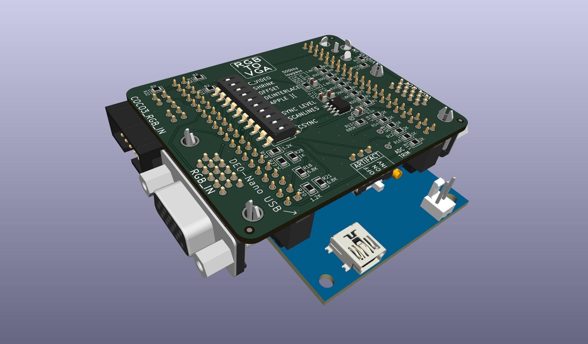
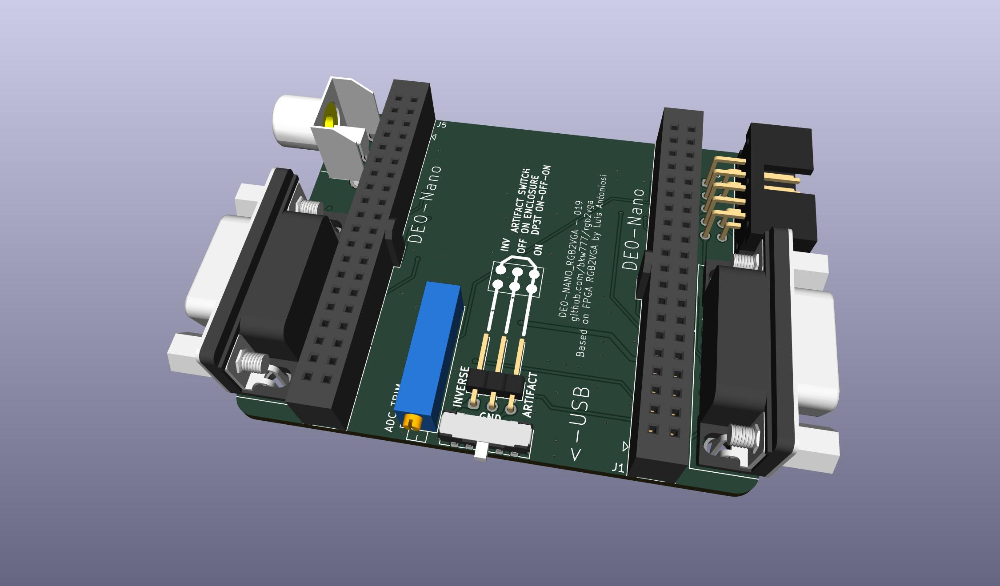
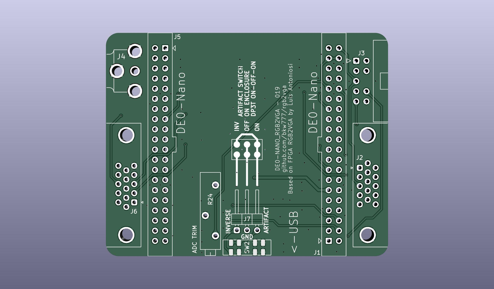
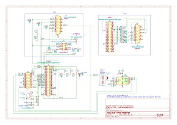

# rgb2vga
Convert 15khz RGB to 31khz VGA

Uses Altera DE0-Nano FPGA development board to convert analog 15Khz RGB signal to VGA 31Khz 256 color.

This is a modified version of the original [RGB2VGA by Luis Felipe da Costa Antoniosi](https://sites.google.com/site/tandycocoloco/rgb2vga).  
( 2024 - Original site is down. [archive.org](https://web.archive.org/web/https://sites.google.com/site/tandycocoloco/rgb2vga) )

The electronics and fpga code are the same as the original.

The resistor values are from [Roger Taylor](http://www.cococommunity.net/vga-for-the-coco-3/).

The physical layout is changed to make a more compact package and to build-in the two modifications described in the original docs.

The schematic and pcb layout are re-drawn from scratch in KiCad to provide editable source files.

The VHDL source is just a fork of [the original](https://github.com/lfantoniosi/rgb2vga) but with all the non-source files cleaned out.  
The VHDL does compile and you can generate a new working rgb2vga.jic from it. But as noted by Roger Taylor, you may want to use the original JIC file from Luis anyway because it may be more stable. There is a preseved copy of Luis's original rgb2vga.jic in [vhdl/Original_JIC](vhdl/Original_JIC).

The enclosure is new, and the OpenSCAD source is included.

Video showing v003 in action.  
[](https://youtu.be/MPYQRHWyUGA)


Alternate enclosure top with screws and nuts for the artifact switch instead of melt-able posts.








<!-- [PCB from OSHPark]()  -->
[PCB from PCBWAY](https://www.pcbway.com/project/shareproject/de0_nano_fpga_rgb2vga.html)  

[BOM from DigiKey](https://www.digikey.com/short/pwd4r9zf)  
(does not include R29 or C4, normally no not populate)

<!-- 
[DE0-Nano](http://www.terasic.com.tw/cgi-bin/page/archive.pl?Language=English&No=593)
When searching other sources like ebay, don't accidentally get **DE0-Nano-SoC**, that's something else.
-->

<!--
## Through-Hole Version


[Through-Hole BOM from DigiKey](https://www.digikey.com/short/5mq32b7z)
-->

## Enclosure
[Enclosure from CraftCloud](https://craftcloud3d.com/offer/e28365bf-4fbd-4414-9492-a3820372ae03)

[PCB Gerbers, FPGA Firmware, Enclosure STLs](../../releases/)

# Directions  
## Building the PCB  
- Remove pin #6 from the 2x5 coco3 rgb connector before soldering. Pin #6 is the center pin on the bottom row, opposite/away from the polarity notch.  
- Solder trim pot R24 on the bottom side, and flush cut and re-flow to smooth domes, before R13, R15, R16.  
- Solder the LM1881 U1 before any of the other parts around it.  
- Solder the Artifact switch SW2 before the 3-pin header J7.  
- Solder remaining parts in any order.  

## Programming the DE0-Nano  
Below is the minimum directions and minimum download possible, using the stand-alone Quartus programmer app and the pre-compiled firmware.  
Alternatively, [compile the firmware from the vhdl source](compile_vhdl.md).

### Install the Quartus Standalone Programmer  
https://fpgasoftware.intel.com/  
Select edition: Lite -> Additional Software -> Quartus Prime Programmer and Tools  
(For Linux, install: Individual Files -> Quartus Prime, not the stand-alone programmer package. The stand-alone Quartus programmer package for Linux is broken, missing ```libprotobuf.so.14.0.0```)

### Download the firmware
Download ```rgb2vga.jic``` from [releases](../../releases/)  

### Program the DE0-Nano  
Connect the usb cable  
Launch the Quartus Programmer app  
Hardware Setup... -> USB-Blaster  
Add File... -> ```rgb2vga.jic```  
Tick "Program/Configure"  
Start  

## Assemble
- Remove the acrylic cover and short upper stand-offs from the DE0-Nano. If using the printed enclosure, remove the lower stand-offs too. If not using the printed enclosure, keep the longer bottom standoffs, replace the short upper standoffs with the screws from the cover.  
- Put the RGB2VGA and DE0-Nano together with the trim pot on the same side as the USB connector.  
- For TANDY Color Computer 3, turn all dip switches off. For most games, turn the Artifact switch on. If using the printed enclosure with enclosure artifact switch, set the pcb artifact switch to OFF.  
- Turn the trim pot to 50%.  
- Insert the IDC pin block-off plugs into pin #6 on each end of the ribbon cable. Pin #6 is the center pin on the row opposite/away from the the polarity bump.  

## Enclosure
The source for the enclosure is the [rgb2vga.scad](case/rgb2vga.scad) OpenSCAD file.

The bottom part of the enclosure has screw holes that will accept the M3 screws that came on the rgb2vga, but the screws are not needed. You can simply remove all hardware parts from the DE0-Nano, put the DE0-Nano + rgb2vga in the case and snap it together.

## Artifact Switch
Cut the 3-pin female jumper cable in half. Set one half aside, it won't be used.

Take one half and solder the cut ends to the slide switch as per the diagram on the silk screen on the bottom of the PCB.

Place the switch onto the posts inside the top cover.  
There will be excess plastic underneath the two mounting posts, preventing the switch from seating flat.  
Just heat the switch flanges with the soldering iron to melt the switch into place flat to the inside wall.

Melt the posts with a soldering iron to secure the switch to the top cover.  

Plug the remaining 3-pin female plug onto the 3-pin male header on the pcb.  

Set the small artifact switch on the pcb to the "OFF" position before closing up the enclosure.
